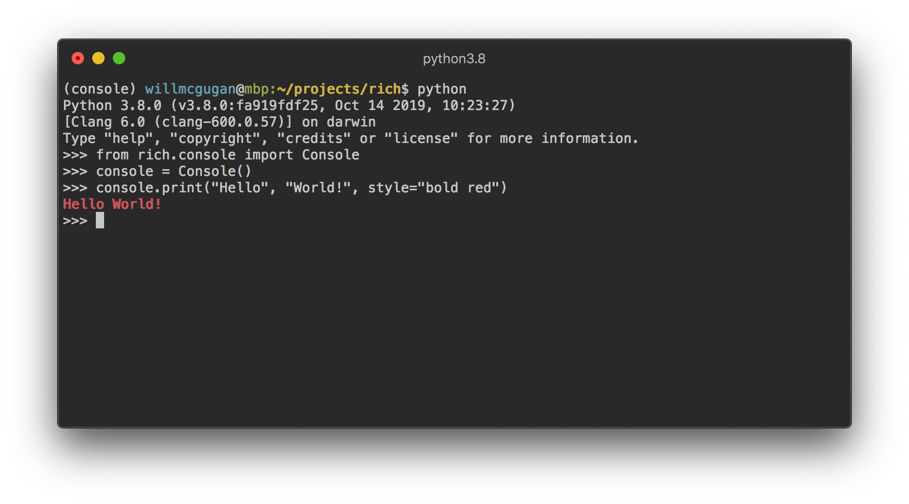
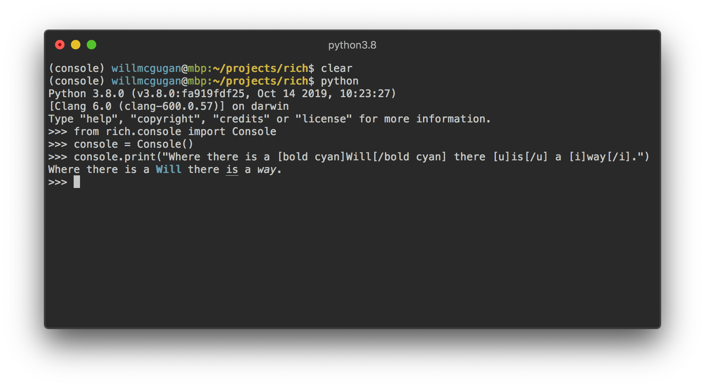
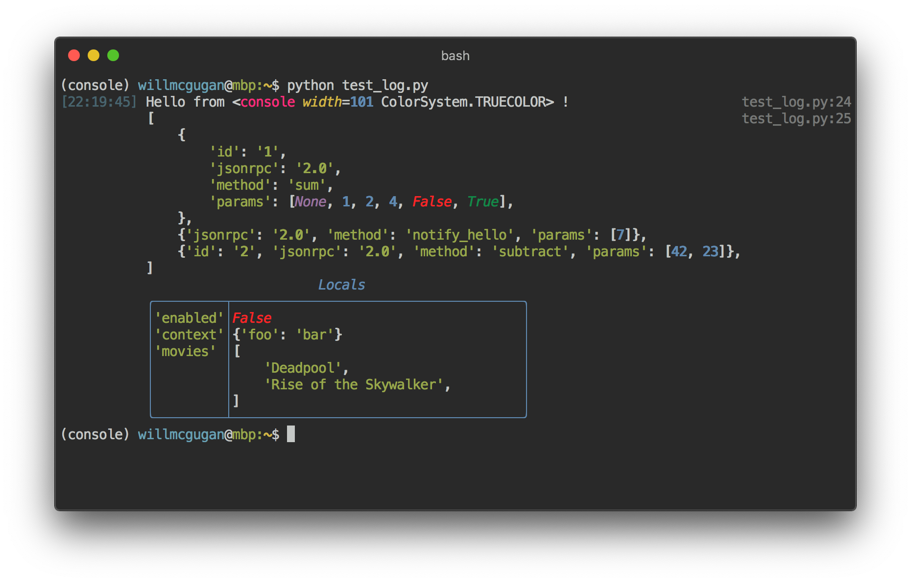
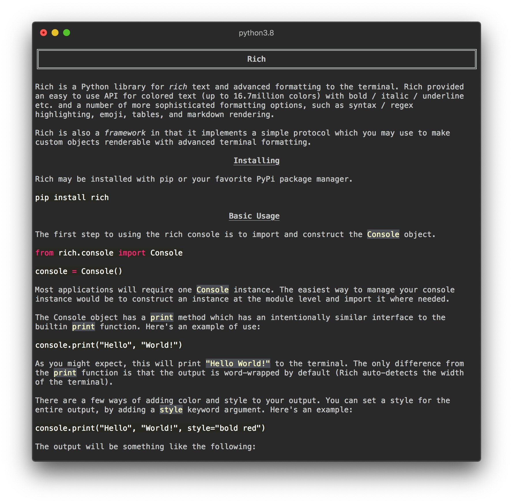
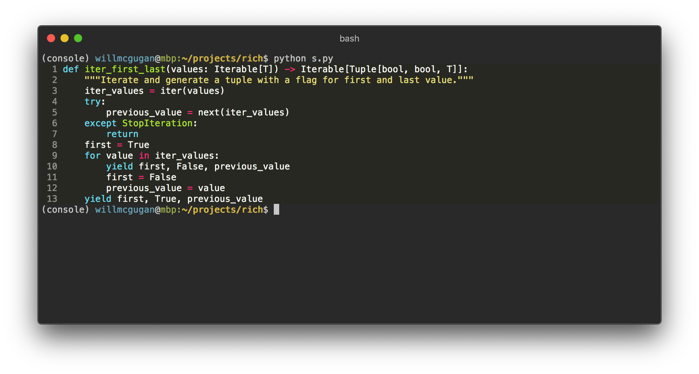
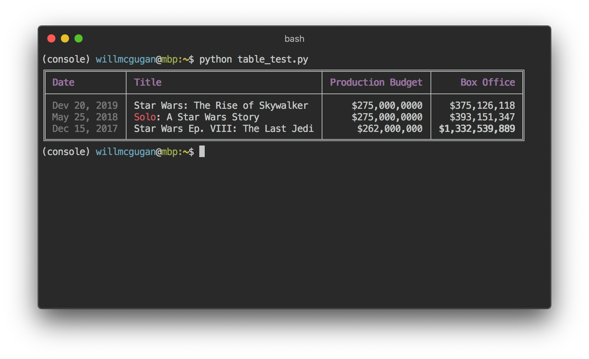
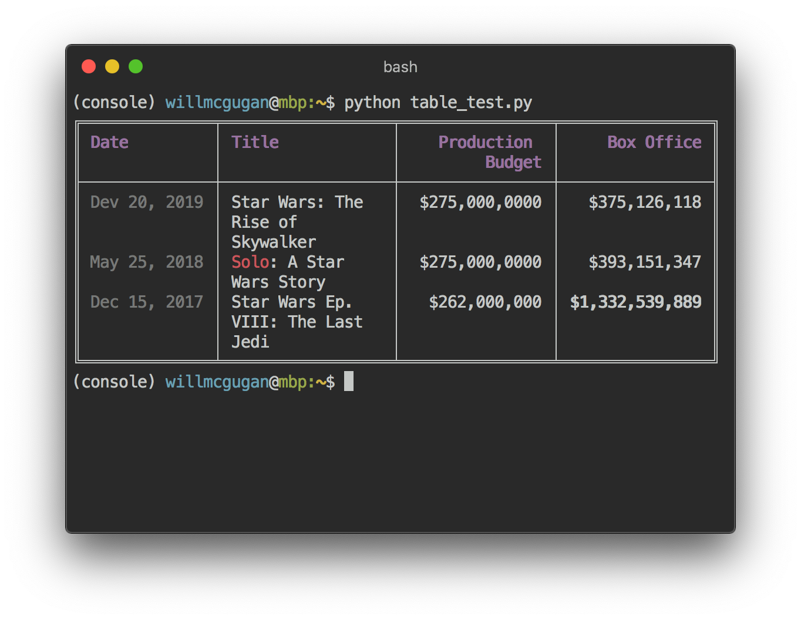

**Note:** This library is currently work in progress. Documentation and tests are coming.

# Rich

Rich is a Python library for _rich_ text and high level formatting in the terminal.

The Rich API make it easy to add colored text (up to 16.7million colors) and styles (bold, italic, underline etc.) to your script or application. Rich can also render pretty tables, markdown and source code with syntax highlighting.

## Installing

Install with `pip` or your favorite PyPi package manager.

```
pip install rich
```

## Console Printing

The first step to using the rich console is to import and construct the `Console` object.

```python
from rich.console import Console

console = Console()
```

Most applications will require one `Console` instance. The easiest way to manage your console instance would be to construct an instance at the module level and import it where needed.

The Console object has a `print` method which has an intentionally similar interface to the builtin `print` function. Here's an example of use:

```
console.print("Hello", "World!")
```

As you might expect, this will print `"Hello World!"` to the terminal. Note that unlike the `print` function, Rich will word-wrap your test to fit within the terminal width.

There are a few ways of adding color and style to your output. You can set a style for the entire output by adding a `style` keyword argument. Here's an example:

```
console.print("Hello", "World!", style="bold red")
```

The output will be something like the following:



That's fine for styling a line of text at a time. For more finely grained styling, Rich renders a special markup which is similar in syntax to [bbcode](https://en.wikipedia.org/wiki/BBCode). Here's an example:

```python
console.print("Where there is a [bold cyan]Will[/bold cyan] there [u]is[/u] a [i]way[/i].")
```



### Defining Styles

Rich expects styles to be specified with a _style definition_ string, which is a intuitive syntax that reads almost like English.

There are a few ways of specifying colors:

- The word `"default"` to select the default foreground or background color.
- The name of the color (one of 256 possible constants) e.g. `"magenta"`. To see the full range of colors run `python -m rich.color` from the console.
- A number between 0 and 255 (inclusive) which corresponds to one of the 256 possible constants above.
- A CSS hex style color, e.g. `#ff0000` or `#d75faf`
- A CSS rbg style color, e.g. `rgb(215,95,175)`

By itself, a color will set the _foreground_ color. To set a _background_ color, precede the color with the word `"on"`. For example `"red on white"`.

Note that the CSS hex and RGB style of color lets you chose one of 16.7 million colors, but some terminals (notably OSX terminal) only support 256 colors. If Rich detects that only 256 colors are supported it will pick the closest color available. In practice this means that you may not get exactly the color you ask for, but it is generally _close enough_.

To set a style or attribute add one or more of the following words:

- `"bold"` for bold text.
- `"dim"` for dim text.
- `"italic"` for italic text.
- `"underline"` for underlined text.
- `"blink"` for text that blinks.
- `"reverse"` to swap foreground and background text.
- `"conceal"` for concealed text (not supported on most terminals).
- `"strike"` for text with a line through it (not supported on all terminals).

Style attributes and colors may appear in any order, i.e. `"bold magenta on yellow"` has the same effect as `"on yellow magenta bold"`. The latter may be preferred by Yoda.

## Console Logging

The Console object has a `log()` method which has a similar interface to `print()`, but also renders a column for the current time and the file and line which made the call. By default, Rich will do syntax highlighting for Python structures and for repr strings. If you log a collection (i.e. a dict or a list) Rich will pretty print it so that it fits in the available space. Here's an example of some of these features.

```python
from rich.console import Console
console = Console()

test_data = [
    {"jsonrpc": "2.0", "method": "sum", "params": [None, 1, 2, 4, False, True], "id": "1",},
    {"jsonrpc": "2.0", "method": "notify_hello", "params": [7]},
    {"jsonrpc": "2.0", "method": "subtract", "params": [42, 23], "id": "2"},
]

def test_log():
    enabled = False
    context = {
        "foo": "bar",
    }
    movies = ["Deadpool", "Rise of the Skywalker"]
    console.log("Hello from", console, "!")
    console.log(test_data, log_locals=True)


test_log()
```

The above produces the following output:



Note the `log_locals` argument, which outputs a table containing the local variables where the log method was called.

The log method could be used for logging to the terminal for long running applications such as servers, but is also a very nice debugging aid.

## Emoji

To insert an emoji in to console output place the name between two colons. Here's an example:

```python
>>> console.print(":smiley: :vampire: :pile_of_poo: :thumbs_up: :raccoon:")
😃 🧛 💩 👍 🦝
```

Please use this feature wisely.

## Markdown

Rich can render markdown and does a reasonable job of translating the formatting to the terminal.

To render markdown import the `Markdown` class and construct it with a string containing markdown code. Then print it to the console. Here's an example:

```python
from rich.console import Console
from rich.markdown import Markdown

console = Console()
with open("README.md") as readme:
    markdown = Markdown(readme.read())
console.print(markdown)
```

This will produce output something like the following:



## Syntax Highlighting

Rich uses the [pygments](https://pygments.org/) library to implement syntax highlighting. Usage is similar to rendering markdown; construct a `Syntax` object and print it to the console. Here's an example:

```python
from rich.console import Console
from rich.syntax import Syntax

my_code = '''
def iter_first_last(values: Iterable[T]) -> Iterable[Tuple[bool, bool, T]]:
    """Iterate and generate a tuple with a flag for first and last value."""
    iter_values = iter(values)
    try:
        previous_value = next(iter_values)
    except StopIteration:
        return
    first = True
    for value in iter_values:
        yield first, False, previous_value
        first = False
        previous_value = value
    yield first, True, previous_value
'''
syntax = Syntax(my_code, "python", theme="monokai", line_numbers=True)
console = Console()
console.print(syntax)
```

This will produce the following output:



## Tables

Rich can render flexible tables with unicode box characters. There is a large variety of formatting options for borders, styles, cell alignment etc. Here's a simple example:

```python
from rich.console import Console
from rich.table import Column, Table

console = Console()

table = Table(show_header=True, header_style="bold magenta")
table.add_column("Date", style="dim", width=12)
table.add_column("Title")
table.add_column("Production Budget", justify="right")
table.add_column("Box Office", justify="right")
table.add_row(
    "Dev 20, 2019", "Star Wars: The Rise of Skywalker", "$275,000,0000", "$375,126,118"
)
table.add_row(
    "May 25, 2018",
    "[red]Solo[/red]: A Star Wars Story",
    "$275,000,0000",
    "$393,151,347",
)
table.add_row(
    "Dec 15, 2017",
    "Star Wars Ep. VIII: The Last Jedi",
    "$262,000,000",
    "[bold]$1,332,539,889[/bold]",
)

console.print(table)
```

This produces the following output:



Note that console markup is rendered in the same was as `print()` and `log()`. In fact, anything that is renderable by Rich may be included in the headers / rows (even other tables).

The `Table` class is smart enough to resize columns to fit the available width of the terminal, wrapping text as required. Here's the same example, with the terminal made smaller than the table above:


