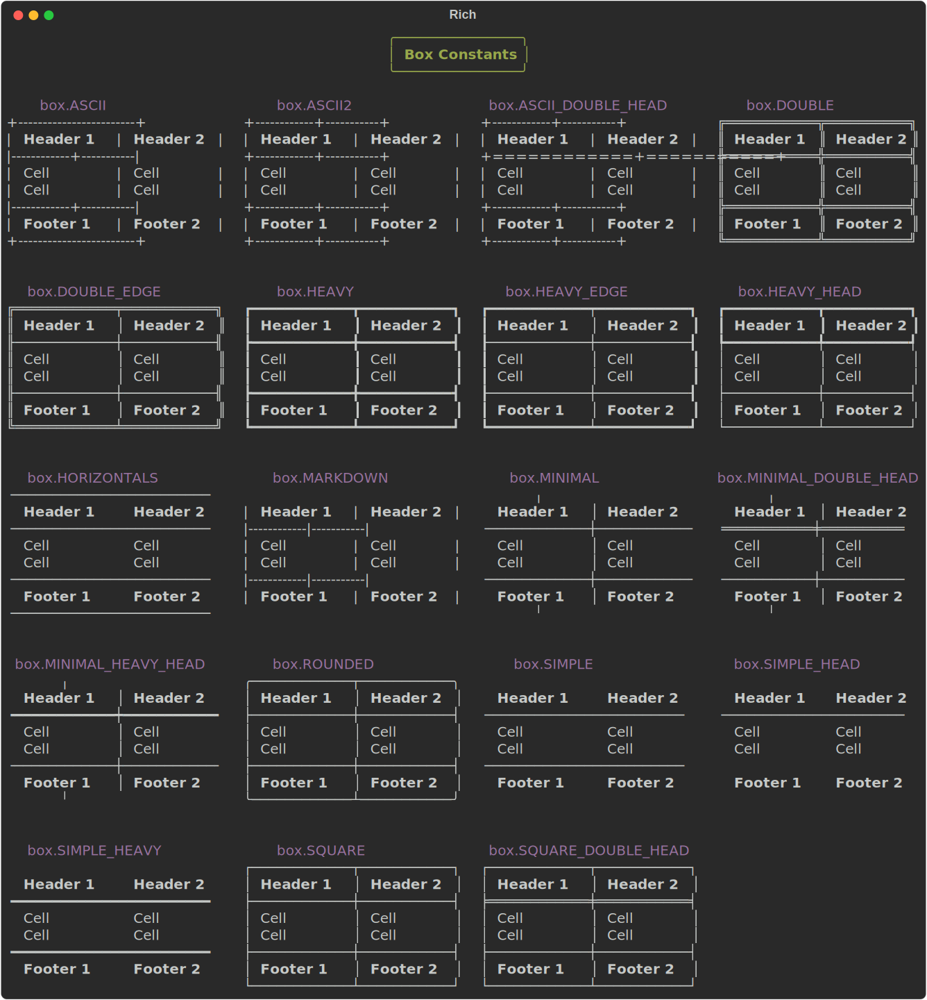

.. _appendix_box:

Box
===

Rich has a number of constants that set the box characters used to draw tables and panels. To select a box style import one of the constants below from ``rich.box``. For example::

    from rich import box
    table = Table(box=box.SQUARE)

.. note::
    Some of the box drawing characters will not display correctly on Windows legacy terminal (cmd.exe) with *raster* fonts, and are disabled by default. If you want the full range of box options on Windows legacy terminal, use a *truetype* font and set the ``safe_box`` parameter on the Table class to ``False``.

The following table is generated with this command::

    python -m rich.box

