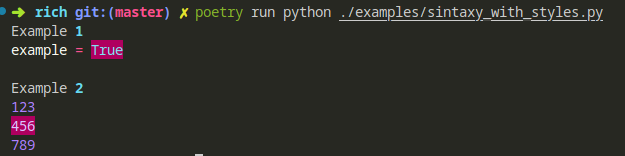

Syntax
======

Rich can syntax highlight various programming languages with line numbers.

To syntax highlight code, construct a :class:`~rich.syntax.Syntax` object and print it to the console. Here's an example::

    from rich.console import Console
    from rich.syntax import Syntax

    console = Console()
    with open("syntax.py", "rt") as code_file:
        syntax = Syntax(code_file.read(), "python")
    console.print(syntax)

You may also use the :meth:`~rich.syntax.Syntax.from_path` alternative constructor which will load the code from disk and auto-detect the file type. The example above could be re-written as follows::

    from rich.console import Console
    from rich.syntax import Syntax

    console = Console()
    syntax = Syntax.from_path("syntax.py")
    console.print(syntax)

Line numbers
------------

If you set ``line_numbers=True``, Rich will render a column for line numbers::

    syntax = Syntax.from_path("syntax.py", line_numbers=True)

Theme
-----

The Syntax constructor (and :meth:`~rich.syntax.Syntax.from_path`) accept a ``theme`` attribute which should be the name of a `Pygments theme <https://pygments.org/demo/>`_. It may also be one of the special case theme names "ansi_dark" or "ansi_light" which will use the color theme configured by the terminal.

Background color
----------------

You can override the background color from the theme by supplying a ``background_color`` argument to the constructor. This should be a string in the same format a style definition accepts, .e.g "red", "#ff0000", "rgb(255,0,0)" etc. You may also set the special value "default" which will use the default background color set in the terminal.

Stylize Range
-------------

With a syntax object you can stylize parts from the text. To achive this, you should use the method stylize_range.
The method stylize_range recieve a Style object and two tuples as positions from text (start and end). This position is formed by Line/Row with 1-based (the first line is 1).
And Column 0-based (the first line is 0).

On the following example I want highlight the true word.

    syntax = Syntax("example = True", "python")

    syntax.stylize_range(Style(bgcolor="deep_pink4"), (1, 10), (1, 14))

Be careful with text when this has line break (\n) because on each \n the line/row number is changed.

On the following example I want put background color in number 456.

    syntax = Syntax("123\n456\n789", "python")

    syntax.stylize_range(Style(bgcolor="deep_pink4"), (2, 0), (2, 3))

The image below is the code above been running.

See thoses examples above at following link.`examples/sintaxy_with_styles.py <https://github.com/Textualize/rich/blob/master/examples/sintaxy_with_styles.py>`.

Syntax CLI
----------

You can use this class from the command line. Here's how you would syntax highlight a file called "syntax.py"::

    python -m rich.syntax syntax.py

For the full list of arguments, run the following::

    python -m rich.syntax -h
    
